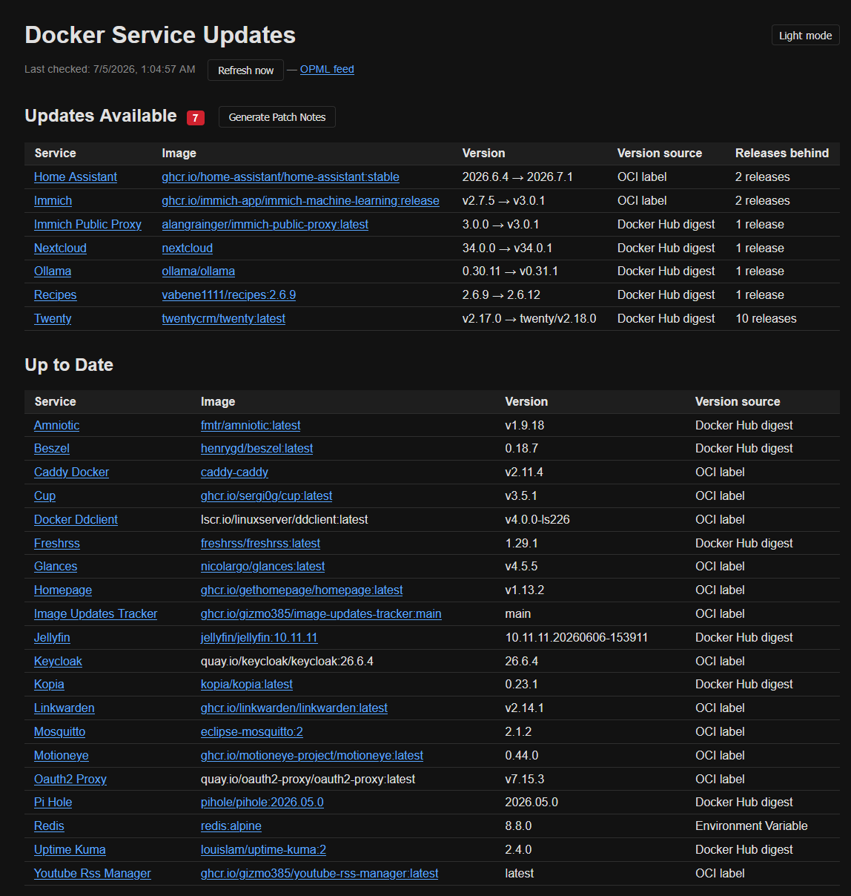
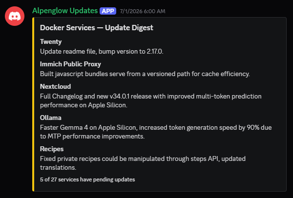

# image-updates-tracker

Tracks running Docker containers and checks for newer releases on GitHub. Provides a web dashboard, an OPML feed of GitHub release feeds, and an optional Discord bot that generates summaries of pending updates.





## Configuration

### overrides.yaml

Mount your own config at `/config/overrides.yaml` (or set `OVERRIDES_PATH` to another path).

```yaml
# Map image names to GitHub owner/repo when automatic detection fails
overrides:
  postgres: postgres/postgres
  redis: redis/redis

# Human-friendly display names for repos
names:
  postgres/postgres: PostgreSQL
  redis/redis: Redis
```

### Environment variables

Copy `.env.example` to `.env` and fill in the values:

```sh
cp .env.example .env
```

| Variable | Default | Description |
|---|---|---|
| `OVERRIDES_PATH` | `/config/overrides.yaml` | Path to the overrides config file |
| `GITHUB_TOKEN` | _(none)_ | GitHub personal access token (recommended to avoid rate limits) |
| `DISCORD_TOKEN` | _(required for bot)_ | Discord bot token |
| `OLLAMA_HOST` | `http://localhost:11434` | Ollama API base URL |
| `OLLAMA_MODEL` | `qwen2.5:1.5b` | Ollama model to use for digest summaries |


## Running with Docker Compose

```yaml
services:
  image-tracker:
    image: ghcr.io/gizmo385/image-updates-tracker:main
    ports:
      - "8585:8585"
    volumes:
      - ./overrides.yaml:/config/overrides.yaml:ro
      - /var/run/docker.sock:/var/run/docker.sock:ro
    env_file: .env

  image-tracker-bot:
    image: ghcr.io/gizmo385/image-updates-tracker-bot:main
    volumes:
      - ./overrides.yaml:/config/overrides.yaml:ro
      - /var/run/docker.sock:/var/run/docker.sock:ro
    env_file: .env
```

Both containers need read access to the Docker socket to inspect running containers.
